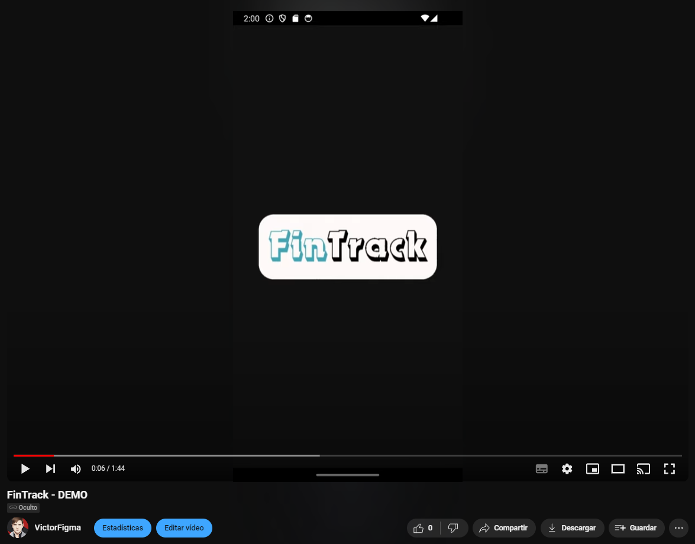

    

## About
FinTrack is an Android APP that tracks the prices of a custom list of stocks. It also includes a portfolio tracking section.

## DEMO
 

## Contact
Victor Figueroa  - victorfigma@gmail.com

## License
**IMPORTANT LEGAL DISCLAIMER**
* Yahoo!, Y!Finance, and Yahoo! finance are registered trademarks of Yahoo, Inc.
* You should refer to [Yahoo!'s terms of use](https://policies.yahoo.com/us/en/yahoo/terms/index.htm) for details on your rights to use the actual data you set queries for.
* You should also follow [yfinance terms of use](https://pypi.org/project/yfinance/).

**IMPORTANT CONSIDERATIONS**
* This app never stores any data of the stock prices.
* This app acts as an android interface of yfinance, you will be the one who download the data. 
* This app was developed for educational purposes only.
* Despite of what the following license says:
	* The app cannot be used for other purposes. 
	* Publishing this app on any store is strictly forbidden.

[FinTrack](https://github.com/VictorFigma/fintrack) © 2024 by [Victor Figueroa](https://github.com/VictorFigma) is licensed under  [Attribution-NonCommercial-ShareAlike 4.0 International](http://creativecommons.org/licenses/by-nc-sa/4.0/?ref=chooser-v1).

(<a href="#top">back to top</a>)

